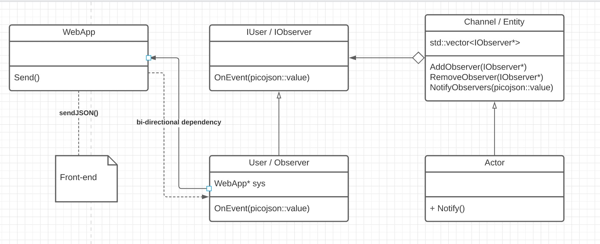

# Observer Pattern

This is an optional lab provided as an extra resource.

## Objective

Learn how to implement a basic observer pattern and deal with some of the complications that may arise in doing so.

## Background

The observer pattern is a software design pattern in which an object, named the subject, maintains a list of its dependents, called observers, and notifies them automatically of any state changes, usually by calling one of their methods. This pattern is one of the most widely used patterns design patterns. It is often necessary for asynchronous systems. If you are familiar with event listeners or push notifications, these are implemented with the observer pattern. The observer pattern is also used for graphical user interfaces.

## Example

The primary components of the observer pattern are the subject and the observer. A great way to think of the observer is as a subscriber. For an example, if you were to subscribe to a YouTube channel, you may be notified every time a new video is released. By subscribing to the channel, the YouTube channel (subject) is attaching your account to its list of accounts to notify. These same actions and components can be represented as functions and classes to build the observer.

<p align="center"></p>

In this UML diagram we have the Entity class which will bind observers and store them in a vector. The Actor class, which is just a child of Entity, can use a notify function to improve readability. Notify would call NotifyObservers and be responsible for constructing the picojson::value. The goal is to have WebApp send the picojson::value back to the front-end. This can be done by calling sendJSON, but the problem is figuring out how to relay that information. This of course is done through the observer, yet some implementations may face a circular dependency.

## Circular dependency

The circular dependency may occur because when an entity is created from the factory pattern, we need to add the observer to the entity. This requires including observer in web_app. Since the Observer class also includes WebApp, this creates a circular dependency. In order to avoid compilation errors with this relationship we can do something called forward declaration. An example is given below.

```
class WebApp;

class Observer {
    // declared function with no implementation
}; 

```
What this does is tell the compiler that the class exists without having to know its implementation. However a limitation of this is that functions of the forward declared class can not be called within the .h file or an error will be thrown because that function may have not been defined yet in the eyes of the compiler.
To fix this issue, we can define the Observer method in <b>web_app.cc</b> with the following code:

```
Observer::OnEvent {
    // implementation that allows WebApp calls i.e. webapp->Send()
}
```

## Naming Conventions 

Lastly, because we do not expect you to have to alter the front-end, the picojson::value to be sent back via the observer should have the following format.

```
{ "notification" : {"type": _type_, "data": _data_ } }
```

The picojson lab describes how to build this, and the types supported are alert and battery. Alert will show a notification similar to the likes of discord. Data will determine what text is presented in that notification. The second type is battery which
if implemented will display a bar that shows the remaining battery life of the drone. The data passed with this notification should be a double value representing the percentage left on the battery. If your max charge is 100 and the charge left is 20, you will want to return 0.2.

## Resources

https://en.wikipedia.org/wiki/Observer_pattern

https://refactoring.guru/design-patterns/observer